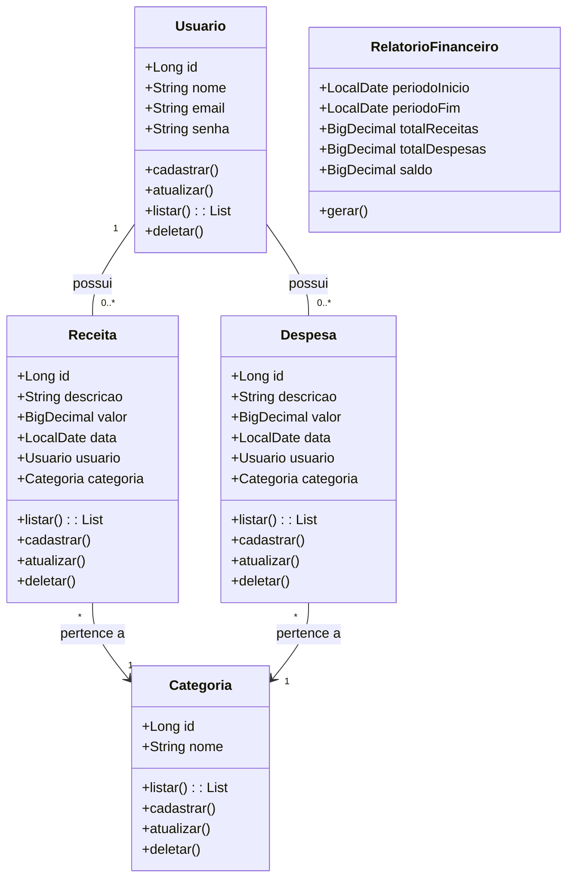

# Sistema de Controle Financeiro Pessoal

## Descrição
O Sistema de Controle Financeiro Pessoal é uma aplicação que permite aos usuários gerenciar suas finanças, incluindo adição de receitas e despesas, categorização de gastos e geração de relatórios financeiros com gráficos.

## Tecnologias Utilizadas
- **Backend**: Java, Spring Boot, Hibernate, JPA, MySQL
- **Frontend**: React, Bootstrap, Chart.js
- **Outros**: Lombok, JWT para autenticação

## Funcionalidades
- Cadastro e autenticação de usuários.
- Gerenciamento de receitas e despesas.
- Categorização de transações.
- Visualização de todas as transações.
- Geração de relatórios financeiros.

## Instalação
Para configurar o projeto em seu ambiente local, siga as etapas abaixo:

1. Clone o repositório:
   ```bash
   git clone https://github.com/seunome/sistema-controle-financeiro.git
   cd sistema-controle-financeiro

2. Configure o banco de dados MySQL e crie o banco de dados controle_financeiro.
3. Abra o projeto no IntelliJ IDEA e baixe as dependências necessárias.
4. Modifique o arquivo `src/main/resources/application.properties` para incluir suas credenciais do MySQL.
5. Execute a aplicação Spring Boot.
6. Inicie o frontend em React.

## Diagrama de Classes


## Como Contribuir:
1. Faça um fork deste repositório.
2. Crie uma branch para a sua feature

     ```bash
      git checkout -b feature/nova-feature
3. Faça suas alterações e adicione os arquivos:

     ```bash
      git add .
4. Realize um commit seguindo o padrão de Conventional Commits.
5. Envie sua branch:

     ```bash
     git push origin feature/nova-feature

6. Crie um Pull Request para ser revisado.

## Licença
Este projeto está licenciado sob a MIT License.

### *Status*: em construção

Desenvolvido por *Aylla Scaglia*
