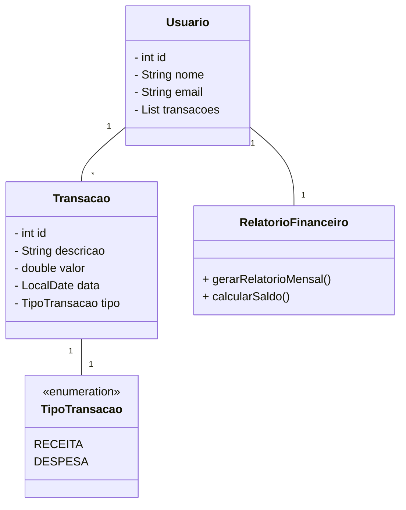

# Controle Financeiro Pessoal 💰

## Descrição
Este projeto é uma aplicação Java desenvolvida para ajudar no controle de finanças pessoais, permitindo o gerenciamento de receitas, despesas e saldos de maneira organizada.

## Tecnologias Utilizadas
- **Java 17**
- **Maven** (gerenciamento de dependências)
- **JUnit** (testes automatizados)
- **SLF4J** (logging)

## Funcionalidades
- Cadastro de receitas e despesas
- Categorização de transações financeiras
- Cálculo de saldo total
- Relatórios financeiros

## Estrutura do Projeto
```bash
Controle-Financeiro/
├── src/
│   ├── main/
│   │   ├── java/com/scaglia/financeiro/
│   │   │   ├── model/
│   │   │   ├── service/
│   │   │   ├── repository/
│   │   │   ├── controller/
│   ├── test/
│       ├── java/com/scaglia/financeiro/
├── pom.xml
└── README.md
```

## 📌 Diagrama UML


```mermaid
classDiagram
    class Transacao {
        - int id
        - String descricao
        - double valor
        - LocalDate data
        - TipoTransacao tipo
    }

    class TipoTransacao {
        <<enumeration>>
        RECEITA
        DESPESA
    }

    class Usuario {
        - int id
        - String nome
        - String email
        - List<Transacao> transacoes
    }

    class RelatorioFinanceiro {
        + gerarRelatorioMensal()
        + calcularSaldo()
    }

    Usuario "1" -- "*" Transacao
    Transacao "1" -- "1" TipoTransacao
    Usuario "1" -- "1" RelatorioFinanceiro
```

## Como Executar
1. Clone o repositório:
   ```sh
   git clone https://github.com/scaglia-aylla1/Controle-Financeiro.git
   ```
2. Entre no diretório do projeto:
   ```sh
   cd Controle-Financeiro
   ```
3. Compile e execute o projeto via Maven:
   ```sh
   mvn clean install
   mvn exec:java
   ```

## Como Contribuir
1. Fork o projeto
2. Crie uma branch para sua feature:
   ```sh
   git checkout -b minha-feature
   ```
3. Faça commit das suas alterações:
   ```sh
   git commit -m "Adicionando nova funcionalidade"
   ```
4. Envie para o repositório remoto:
   ```sh
   git push origin minha-feature
   ```
5. Abra um Pull Request 🚀

---
📌 **Status do Projeto:** Em desenvolvimento ⚙️

### Desenvolvido por **Aylla Scaglia**